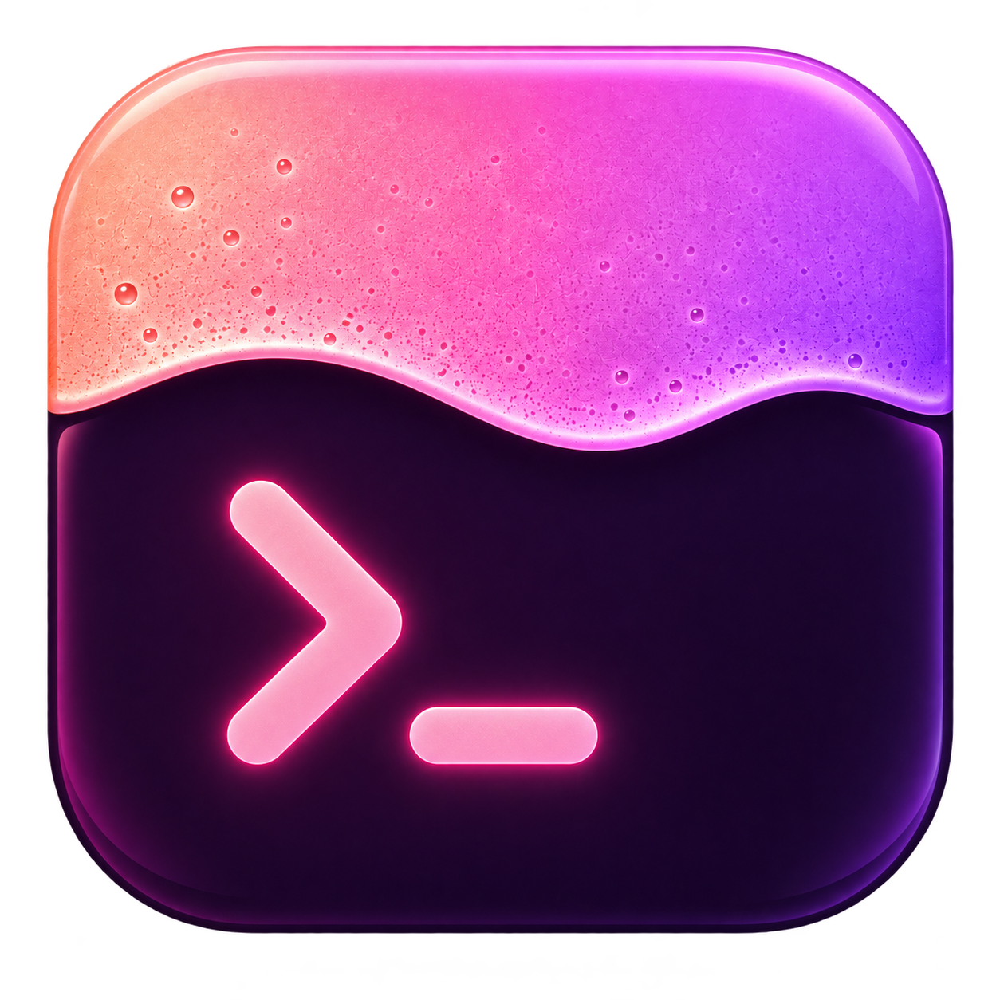

# Crema

A Crush-style terminal UI for the coding agents you already pay for.
Crema drives the **official** Claude Code and Codex CLIs in headless mode, so your
subscription login keeps working and **crema never sees an API key**.

A turn is judged by what it changed, so **file edits arrive open** and the rest
— the shell commands, the searches, the reading, the thinking — folds into a
single grey line you can click: `▸ Ran 2 shell commands · Read 1 file`. Nothing
is thrown away; that line opens onto all of it. A live `git diff` panel sits on the right and
refreshes as the agent works.

Open as many agents as you like. Each one has its own backend, its own working
directory, and its own conversation, and they **run at the same time** — fire off
a refactor in one project, switch to another agent while it works, and come back
when the sidebar says it's done.

## Quickstart (under two minutes)

1. Install and sign in to at least one agent CLI (crema never handles credentials):
   - Claude Code — https://claude.com/claude-code, then run `claude` once to log in
   - Codex — `npm i -g @openai/codex`, then run `codex` once to log in
2. Install crema:
   ```
   go install github.com/ShukunCheng/Crema/cmd/crema@latest
   ```
   or grab a binary from the releases page.
3. Check your setup and start:
   ```
   crema --doctor
   cd your-project
   crema
   ```

No agent installed yet? `crema --agent mock` runs a scripted demo so you can see
the interface without spending anything.

## Keys

| Key | Action |
|---|---|
| `enter` | send the message to the focused agent — from any pane, once something is written; while the agent works, the message waits in line instead of being refused |
| `shift+enter` / `ctrl+enter` / `alt+enter` / `ctrl+j` | newline — the box grows with the draft, up to six rows |
| paste | multi-line text lands whole; its newlines don't send |
| `ctrl+v` | paste — a copied **image** attaches as `[Image #1]` |
| `ctrl+backspace` | delete the word before the cursor |
| `/` (at the start of the input) | list the agent's slash commands and skills |
| `@` (anywhere in the input) | list the project's files |
| `↑↓` (with either list open) | move through the matches |
| `tab` / `enter` (with either list open) | take the highlighted name and move on |
| `esc` | close the list, or cancel the focused agent's turn — which also drops whatever was waiting behind it |
| `ctrl+n` | new agent — pick a backend, then browse to a working directory |
| `ctrl+w` | close the focused agent — or click the `×` on any agent's row (closing the last one quits) |
| `tab` / `shift+tab` | next / previous agent |
| `alt+1` … `alt+9` | jump straight to that agent |
| `ctrl+b` | show/hide the agent sidebar |
| `↑` (from the input) | walk back through what you have asked this agent; `↓` walks forward again |
| `↓` (at the end of the history) | highlight the model / permissions buttons above the input; `enter` opens one |
| `ctrl+p` | the same buttons, from anywhere |
| drag in the conversation or the diff | select text; copies to the clipboard on release, and `ctrl+c` copies it again |
| `ctrl+t` | cycle the diff: hidden → beside the conversation → full screen (or click the buttons on its header) |
| `ctrl+f` | find in the diff (`/` too, when the diff has the focus) — shows it if it was hidden |
| `ctrl+l` | switch between light and dark |
| `ctrl+r` | refresh the diff and the command list now |
| `ctrl+o` | move focus: input → timeline → diff |
| `pgup` / `pgdn` / `home` / `end` | scroll the focused pane |
| `ctrl+c` | copy the selected text |
| `ctrl+q` | quit |

Typing anywhere goes into the message box — if the focus was on the conversation
or the diff, the first character takes it back. Movement keys and shortcuts stay
with whatever is focused.

`shift+enter`, `ctrl+enter` and `ctrl+backspace` reach crema by a side door.
The Windows console reader hands over a plain enter and a plain backspace with
the modifier discarded, so when one arrives crema asks the OS whether shift or
control is actually held and rewrites the key. The shift question is only asked
about an enter, and only when control wasn't already the answer, so an ordinary
keystroke costs nothing extra. Terminals that encode those keys themselves send
`^J` and `^H`, which are bound directly, and `shift+enter` is bound by name for
the ones that report it.

Enter carries the most weight of any key — the same keystroke is a send, a
chord's newline, or one character of a paste the console is replaying — so
every enter goes through a single judgment, and `/keytest` opens a picker of
scenarios that each put a set of facts to that judgment and print the verdict
and the reason. Two details keep real sends from vanishing. A quick tap can be
over before a busy frame gets around to reading it, and "is the key down right
now" would say no and file the send as a pasted newline; crema instead asks
the OS whether enter was pressed *at any point since it last asked*, which a
replay never trips. And a written draft plus enter sends from any pane — it
used to be silently ignored after a click into the conversation, which read as
the agent not answering.

Panes drop away as the terminal narrows so crema stays usable at 80×24: the diff
pane needs 124 columns, the sidebar needs 70. Above those floors `ctrl+t` and
`ctrl+b` decide. When the sidebar is hidden, the status bar still shows which
agent you're on and how many are running, e.g. `Claude Code [2/3] · 1 running`.

## Mouse

The whole interface is clickable:

| Click | Action |
|---|---|
| an agent in the sidebar | switch to it |
| the same agent twice | rename it — the command lands in the input box, filled in |
| drag an agent up or down the sidebar | reorder the list |
| the `×` at the end of its row | close that agent (closing the last one quits) |
| `+ new agent` | open the picker |
| the `[ dark ]` / `[ light ]` chip in the status bar | switch theme |
| the `side` / `full` / `off` buttons on the diff's header | put the diff at that size |
| the `[ diff ]` chip in the status bar (only while it's hidden) | bring the diff back |
| a row in the picker or in a completion list | choose it |
| a message waiting in the queue | take it back into the input box |
| the `model` / `permissions` buttons above the input | open that button's values |
| any pane | focus it (so `pgup`/`pgdn` go there) |
| a tool block's header line | fold or unfold that block |
| a file's header line in the diff | fold or unfold that file |
| a file in the full-screen list | show that file's diff |
| drag in the conversation or the diff | select text, copied on release (see below) |
| scroll wheel | scrolls whichever pane is under the pointer, focused or not |

An open block shows `▾ Bash` and the whole thing under it. What arrives folded:

| | |
|---|---|
| open | the agent's prose, file edits (`Edit`, `Write`, `MultiEdit`, `NotebookEdit`, codex's `apply_patch`), and any tool that **failed** |
| folded | every other tool call, ordinary tool output, thinking, and a subagent's prose |
| as a diff | an edit is drawn as the change it makes — removed lines on a red band, added lines on a green one, shared lines as context — rather than as the JSON arguments describing it |

**A run of folded blocks is one line.** A turn that runs three commands is three
calls and three outputs — six rows of `▸ …` saying nothing. Neighbouring folded
blocks are summarised together instead, in grey, by what they did rather than
by what is hidden:

```
▸ Ran 2 shell commands · Read 1 file
```

Clicking it opens the whole run at once, never a summary of it. Anything that
stays open — prose, a file change, a failure — breaks the run in two, so the
line always describes exactly the stretch it sits in.

**A subagent's work folds under its own name.** The model can hand work to a
subagent, and everything that subagent does streams through crema tagged as
its — tools, thinking, and its report alike fold into a line of their own:

```
▸ subagent · Ran 3 shell commands · Thought twice · Reported back
```

One click opens all of it, so checking a subagent's work is the same gesture
as checking anything else's. Its prose folds too — it reported to the model,
not to you, and the main conversation carries what came of it — but its file
edits and failures arrive open, because a turn is judged by what it changed,
whoever in it did the changing. A subagent's run never merges with the main
turn's: the summary line says whose work it stands for.

While background work runs, the working line counts it — `… · 2 background
tasks · esc to cancel` — and `/tasks` lists every subagent and backgrounded
command of the session: status, what it was asked, its spend so far, and what
it is running right now. `/tasks <id>` reads the tail of the output file the
CLI keeps for it, so a long-running subagent can be looked in on before it
reports. A turn that launches an async subagent also genuinely outlives its
first result — the CLI ends the turn, then revives it when the task finishes
— and crema follows: the turn ends when the process exits, money is counted
once per leg, and a message you queued meanwhile waits for the real end.

**A markdown table is drawn as a table.** Plain wrapping shatters one — the
rows are long, the wrap breaks them mid-cell, and the columns fall apart. So
assistant prose is scanned for tables and each one is drawn: columns sized to
the pane, a rule under the header, and a long cell wrapped inside its own
column. Fenced code keeps its pipes, a stray `|` in prose is not a table, and
a pane too narrow for the columns falls back to readable `a · b · c` rows
rather than four-character confetti.

Three things are painted as bands across the row rather than coloured text:
what **you** typed, on grey, so a long conversation can be skimmed for where
you last spoke; and the lines a change **added** and **removed**, on green and
red. The two diff bands are the same in the conversation and in the diff pane,
in both views and both themes — one definition, so the panes can't drift.

The diff pane folds the same way and starts the same way: **files arrive
folded**, so the pane is a list of what changed and by how much, and you click
a file to read it. What you opened stays open across refreshes, so an agent
writing files won't fold away what you were reading. Open files show `▾`.

## Selecting text

**Drag inside the conversation or the diff to select, and it copies on
release.** No modifier, and clicking keeps working everywhere else — a press
only becomes a selection once you move, so dragging across a tool block or a
file header selects it instead of folding it.

Crema draws that selection itself. Mouse reporting is all-or-nothing for the
whole terminal, so there is no way to ask for "the terminal selects in this pane
and the app clicks in that one"; the only way to get plain-drag selection in the
output while the sidebar stays clickable is for the app to implement it.
Which also means it can be smarter than a raw terminal selection: the `│ ` guide
down the side of tool blocks is decoration, so it's stripped from what you copy —
you get `go test ./...`, not `│ go test ./...`.

Both panes select the same way, and only one at a time: starting a drag in one
drops the other's highlight, so `ctrl+c` is never ambiguous about which it
means. In the diff you get exactly the rows and columns you dragged over — a
path, a hunk header, the `+` line an agent just wrote — and in the split view,
one side of the divider if that's all you crossed.

`ctrl+c` copies the highlight again, which is what the reflex expects it to do —
so it is **not** the quit key here; `ctrl+q` is. `esc` clears the highlight (and
only then cancels a running turn, if you press it again). Clicking any other
pane clears it too. The status bar confirms each copy.

Shift+drag still works as well, and hands the job to the terminal instead —
worth knowing for the sidebar and the status bar, which crema doesn't select
in, and for grabbing a rectangle across both panes at once.

## The diff — `ctrl+t`, or the buttons on its own header

The pane carries its own title bar: what changed on the left, the three sizes
on the right, with the one it is at picked out. Clicking one goes straight
there; `ctrl+t` still cycles. Hidden, the pane has no header to carry them, so
a `[ diff ]` chip appears in the status bar beside the theme one — the way back
is never further than a click.

```
 changes  14 added 5 removed                                    side  full  off
```

The shape of the diff follows the room it has:

| | |
|---|---|
| hidden | the conversation gets the width |
| beside the conversation | **unified**, the way a pull request reads: one column, `+`/`−` prefixes, files folded until you click one |
| full screen | a **browser**: the changed files down the left, the one you picked beside them |

### Full screen

```
 changes  14 added 5 removed                                    side  full  off
── STAGED                         │  before                │  after
 staged.go                  +1 −0 │@@ -10,4 +10,12 @@
── UNSTAGED                       │   10 func main() {     │   10 func main() {
 work.go                    +1 −1 │   11     start()       │   11     start(withOptions)
 internal/ui/app.go        +12 −4 │   12 }                 │   12 }
```

`↑↓` walk the list and the diff follows; `pgup`/`pgdn` scroll the diff itself;
clicking a file picks it. The body drops the section and file headers the
stacked view needs — the list has already said which file this is and what it
gained — and shows the file **split**, the way a merge tool reads: before on
the left, after on the right, a rewritten line showing both on one row with
line numbers down each gutter. A line with no counterpart is drawn against a
blank band on the other side, which is what makes it read as an insertion
rather than as a shifted line.

Searching (`ctrl+f`) moves the selection to the file the text is in, since only
one file is on screen at a time. Below 60 columns there is no room for a list
and a readable diff, so full screen falls back to the stacked view, and the
split gives way to unified below 49.

Added is green and removed is red everywhere the two are counted or drawn: the
lines themselves, the file headers, and the list.

Full screen means the whole frame: the sidebar and conversation stand aside and
the focus moves to the diff. Typing anything takes the focus back to the
message box.

### Finding something in it — `ctrl+f`

A diff is the one pane you arrive at already knowing what you're looking for:
the function you renamed, the file you meant to leave alone. `ctrl+f` opens a
find box on the last row of the pane (`/` does the same when the diff has the
focus), and shows the diff first if it was hidden — asking to search something
invisible is asking to see it.

```
find allocate▌                          3/7  ↑↓ move · esc close
```

Every match is marked as you type, the current one picked out from the rest;
`↑↓` (or `enter`) steps through them, wrapping at both ends, and the pane
scrolls to keep the current one a third of the way down. `esc` closes the box.

**It searches the whole diff, not just what's on screen.** Files arrive folded,
so a search that only read the visible rows would confidently find nothing;
crema opens the files the text is in and counts what's in them. Narrowing the
query closes again what a shorter prefix had opened — typing `new` passes
through `n`, which matches nearly everything — and a file *you* opened is
yours: the search never folds it. Whatever it found stays open when you close
the box, since finding it was the point.

A path is as findable as a line, both views search the same way, and a
background refresh keeps the highlight live, so a file the agent touches while
you're looking joins the results on its own.

## What the status bar tells you

Three rows, in the shape a shell prompt HUD uses — a dim label, a bright value,
groups fenced off with `│`. The gauges are drawn as coloured blocks; they're
sketched here with `█` and `░` because a README has no colour:

```
 ● Claude Code [1/2] │ [opus] │ D:\Crema git:(main* +43 −61 ?8) │ 12.5s │ $0.4231
 Context ██░░░░░░░░ 21% │ 5h █░░░░░░░░░ 13% (resets in 1h 51m) │ 7d ███░░░░░░░ 27% (resets in 3d 5h)
 ▸▸ full access (ctrl+p to change) · 1 running                   [◨ side][ dark  ]
```

**Who and where.** The focused agent (with `[1/2]` when several are open), its
model, the working directory, and that directory's git state: branch, `*` when
it's dirty, then the lines added and removed and the files git isn't tracking.
While a turn runs the spinner replaces the `●` and the timer counts up; spend
so far sits at the end.

**What's running out.** How full the model's context window is, then each of
the subscription's allowance windows with a countdown to reset. A bar is filled
by proportion and coloured by how alarming it is — green, then yellow past 60%,
then red past 85% — because that is the only thing the colour of a gauge should
ever mean. A number nobody reported is never invented: an unknown context draws
an empty track and a dash, and an allowance window with no percentage shows its
name and its reset with no bar at all. See [where those numbers come
from](#where-the-context-and-usage-numbers-come-from) — both were wrong until
they were measured.

**What it may do.** The permission mode, the transient note (what was copied,
what's queued, what failed), and the two buttons: the diff's size, and the
theme.

A terminal under 16 rows can't spare three rows of chrome, so it gives up the
gauge row — the two percentages move up to the first row rather than
disappearing.

### Where the context and usage numbers come from

Both of these read plausibly and were wrong, so both were measured against a
real account on Claude Code 2.1.229.

**Context** is not the turn's token bill. A turn is one bill but many API
calls, and every call re-reads the whole conversation, so the `usage` on the
`result` line — which is what crema used to read — counts the conversation once
per call. A measured three-call turn billed 73,420 input tokens against a
conversation that was 41,922 tokens long: 37% of the window claimed, 21% real,
and the gap widens with every tool call. What actually fills the window is the
**last** call's input, and every `assistant` message carries the usage of the
call that produced it. Crema keeps the last one.

**The usage percentage is not in the headless stream at all.** The
`rate_limit_event` names the window and says when it resets, but the
`utilization` field older CLIs sent is gone, so crema was rendering a confident
`5h 0%` on every turn. On 2.1.229 there is no local file with it either:
`~/.claude/.usage_cache.json` is an older version's cache, and on this machine
it had not been written since March — not even by an interactive session
running at the time. Crema still reads it, honouring each window's own
`resets_at` as an exact freshness test, but expect nothing from it.

So without help, that half of the row is a window name and a countdown, which
is all anybody actually told crema. Two things improve on it:

- Once a window is far enough along, the CLI starts sending
  `surpassedThreshold` — a floor rather than a figure. Crema shows it as
  `5h over 75%`, coloured like a gauge at that level. It arrives exactly when
  the answer starts to mattering.
- The **status-line bridge** below gets the real number.

Codex reports neither figure, so both segments are simply absent for Codex
agents rather than guessed at.

### The status-line bridge — real usage percentages

Claude Code *does* know the live allowance: it hands the numbers to your
**status-line program** on every render, which is where tools like claude-hud
get `Usage 87%`. A headless run has no status line, so crema is never told. But
crema can stand in front of yours:

Copy your current status line into a file of its own — say
`~/.claude/hud-statusline.sh`, byte for byte — and point crema at it:

```jsonc
// ~/.claude/settings.json
"statusLine": {
  "type": "command",
  "command": "crema statusline --then-file \"C:/Users/you/.claude/hud-statusline.sh\""
}
```

A file rather than an inline `--then "<command>"`, because a status line is a
shell one-liner carrying its own quoting — the one in the wild nests single
quotes inside single quotes to feed `awk` — and escaping that into a second
command line is exactly how you break somebody's status bar. A path has no
quoting for crema to get wrong. (`--then` is still there for something simple
enough to inline.)

`crema statusline` reads the payload, writes the allowance to
`%APPDATA%\crema\usage.json`, and runs your real status line with the same
input on stdin — so what you see in an interactive session is unchanged. Every
crema then shows the percentage those sessions were told, gauge and all. With
no `--then-file` it records silently and prints nothing, which is only what you
want if you had no status line to begin with.

It is the CLI's own figure passing through. **Nothing in it reads a credential
or calls an API** — crema will not go asking the usage endpoint itself, because
that would mean handling your login, which is the one thing it promises not to
do.

Every window the payload carries gets the same treatment as the context gauge:
a filled bar, a percentage, and when it resets — the five-hour one and the
weekly one side by side. Crema re-reads the record every 30 seconds while it
sits there, so the bars follow your interactive sessions rather than waiting
for a turn to end.

The record expires the same way the CLI's cache does: a window past its
`resets_at` is dropped rather than shown stale, so if you stop running
interactive sessions the percentages fade out and the countdowns come back. The
bridge can never break your status line — whatever happens to the recording,
your command still runs and its output still goes through.

## Multiple agents

`ctrl+n` opens a two-step picker: choose a backend, then browse to the folder
that agent should work in. The browser is plain terminal UI rather than a native
dialog, so it still works over SSH — `↑↓` to move, `enter` to open a folder,
`←` to go up, and the `[ use this directory ]` row to accept the current one.

Because each agent owns a directory, giving two agents separate projects (or
separate clones) keeps their edits from colliding. Pointing two agents at the
same directory is allowed, but they will overwrite each other's work without
warning — crema does not arbitrate.

**Double-click a row to rename it.** Three agents on one project all read
`claude · Crema`; what tells them apart is what each is for, which only you
know. There is no text field in the sidebar, so the rename lands in the box you
already type in — `/rename web` with the current name filled in, ready to edit.
`/rename` on its own gives the agent its derived name back. Names are saved
with everything else.

**Drag a row to reorder the list.** The order is yours — `alt+1`…`alt+9` jump
by position and `tab` walks it, so which agent is first is a decision about how
you work rather than about when you happened to open it. The row in hand
follows the mouse: it is painted lifted — the user band behind it, a `▌` grab
mark in the margin — and the move happens live as the pointer crosses rows, so
the list under the cursor is always the list you will get. Dragged past either
end it rides at that end rather than being dropped, and the landing is
announced once, on release. The row moves as the
pointer crosses another one, so the list under the cursor is always the list
you will get, and the order is saved with everything else. Dragging the `×`
does nothing: that button closes.

The sidebar lists every open agent with its live state, so you can see at a
glance which ones are still working:

```
╭──────────────────────╮
│AGENTS                │
│▸ 1 claude · api  ⣾ 7s│
│  2 codex · web   idle│
│  3 claude · docs ⣷12s│
│                      │
│+ new agent  ^n       │
╰──────────────────────╯
```

## Memory between runs

Crema remembers your open agents. Quit with three agents going and the next
launch brings all three back — same backends, same directories, same
conversations, and each one continues its *agent* session too, so Claude Code or
Codex still has the context you built up rather than starting cold.

Spend, permission mode, model, and how full the context window was come back
with each agent. The context figure is only restored alongside a session id
that will actually be resumed: without one the next turn starts empty, whatever
the last one measured. Your theme choice is remembered as well.

The usage windows are deliberately *not* remembered — see [where those numbers
come from](#where-the-context-and-usage-numbers-come-from). A percentage from
last week is worse than no percentage.

State lives in `state.json` under your user config directory
(`%APPDATA%\crema\` on Windows, `~/.config/crema/` elsewhere), written with
owner-only permissions because saved conversations and tool output can contain
anything from your repositories. It is written atomically after every finished
turn, so a crash costs you at most the turn in flight.

To skip restoring and start with a single fresh agent:

```
crema --fresh
```

Naming `--dir` or `--agent` explicitly still restores everything and then
focuses (or opens) the one you named.

Two bounds keep the file small, and both announce themselves in the restored
conversation rather than quietly losing history: the last 300 entries per agent
are kept, and any single entry over 20,000 characters is cut with a counted
marker. Agents whose directory has since been deleted are skipped with a visible
reason instead of silently vanishing.

## Themes

Crema ships a pink/purple palette in both light and dark. It picks one by asking
your terminal about its background at startup; override with `--theme light` or
`--theme dark`.

Both themes paint their own background across the whole screen rather than
letting your terminal's show through, so dark mode is genuinely dark even in a
light terminal — and stays readable either way.

Crema also asks the terminal to adopt the theme background as its default
(OSC 11), so the emulator's own window padding matches instead of framing a dark
theme in white, and hands the color back on exit. Terminals that don't implement
that sequence ignore it; if yours does and crema is killed rather than quit, a
new tab clears it.

To switch while running, click the chip at the right end of the status bar or
press `ctrl+l`. The chip always shows the current mode and is the last thing the
status bar gives up as the terminal narrows, so it stays reachable:

```
 ● Claude Code · full access · $0.14 · +12 −3       D:\my-project [ dark  ]
                                                                  ^ click me
```

## Flags

```
crema [--agent claude|codex|mock] [--dir PATH] [--theme auto|light|dark]
      [--doctor] [--version]

crema statusline [--then-file <path>]   # the usage bridge, above
```

`--agent` and `--dir` set up the first agent; everything after that is `ctrl+n`.

## How it works

| | |
|---|---|
| Claude Code | `claude -p <prompt> --output-format stream-json --verbose --permission-mode bypassPermissions`, resumed with `--resume <session_id>` |
| Codex | `codex exec --json --full-auto <prompt>`, resumed with `codex exec resume <thread_id>` |
| Diff | `git diff --cached`, `git diff`, and `git ls-files --others --exclude-standard`, parsed in-process |

Crema spawns these CLIs as subprocesses and normalizes their JSON event streams
into one internal event type. It never stores tokens and never talks to any
model API directly. The only CLI files it reads are the command and skill
folders below, and it only reads them.

## Completing names — `/` and `@`

Two things complete in the input box, and both work the same way: the draft
stays exactly as you typed it, nothing is written into the box until you take a
name with `tab` or `enter`, `↑↓` moves through the matches, and `esc` closes
the list.

- **`/` at the start** lists everything the focused agent has — the commands
  and skills on disk, the CLI's own built-ins as it reported them, and crema's
  own (below) — in one alphabet.
- **`@` anywhere** lists the project's files, so a file can be named in the
  middle of a sentence: `explain @internal/ui/app.go`. Matches rank by the
  whole path first, then by the file name, so `@app.go` finds
  `internal/ui/app.go`.

Either name goes to the CLI verbatim in the prompt, so the CLI expands it
exactly as it would in its own interface.

The file list comes from `git ls-files` — tracked files plus untracked ones
that aren't ignored — so it is the project rather than its build output. A
directory that isn't a repo is walked instead, skipping dot-directories and
`node_modules`.

| Backend | Where it looks |
|---|---|
| Claude Code | `<project>/.claude/commands/**.md`, `<project>/.claude/skills/*/SKILL.md`, the same two under `~/.claude`, and `commands/` + `skills/` in every plugin listed in `~/.claude/plugins/installed_plugins.json` |
| Codex | `<project>/.codex/prompts/*.md` and `~/.codex/prompts/*.md` |

## The CLI's own commands — `/clear`, `/compact`, `/model`

`/clear` and its siblings belong to the CLIs' **interactive** interfaces. A
headless run has no such interface, so they aren't commands there at all: they
are short prompts the model reads, thinks about, and answers. Measured against
a real account, `claude -p "/clear"`, `"/compact"` and `"/model"` each ran a
full turn and cost about **$0.29** to be told nothing.

So crema does them itself:

| | |
|---|---|
| `/clear` | drop the conversation and the backend session behind it — the next message starts a run with no `--resume`, so the agent has never heard of any of it |
| `/compact` | ask the agent to summarise the conversation, then clear it and put that summary in front of your next message. Two steps, one extra turn, and the new session opens knowing where the old one got to |
| `/resume` | point the agent at any conversation this project has had — the CLI's own or crema's. `/resume` lists them newest first (when each last moved, how each began) in the option picker; `/resume <id>` attaches directly. Interactively this is the CLI's own session picker; headless the CLI doesn't offer it, so crema reads the same `~/.claude/projects` files the picker does |
| `/model` | `/model opus` sets it; `/model` on its own opens the panel `↓` opens |
| `/permissions` | the same panel |
| `/rename` | call this agent something — `/rename api`, or `/rename` to undo |
| `/cost` | spend, context, and the usage window, in the conversation |
| `/diff` | hidden → beside the conversation → full screen |
| `/keytest` | why an enter sends or breaks the line — a picker of scenarios, each put to the real judgment |
| `/tasks` | the session's subagents and backgrounded commands; `/tasks <id>` reads one's output file |
| `/help` | crema's commands and keys |
| `/quit`, `/exit` | close crema |

Seventeen more — `/config`, `/context`, `/doctor`, `/agents`, `/mcp`, `/usage`,
`/effort`, `/fast` and the rest of the CLI's own settings and diagnostics — get
a straight answer in the conversation saying they don't exist headlessly,
rather than being sent off to be charged for.

**Everything else the CLI has, crema offers and sends.** The `init` message of
every run carries the CLI's own `slash_commands` list, so crema asks rather
than guesses: `/init`, `/security-review`, `/code-review`, `/simplify`,
`/deep-research` and every plugin command and skill appear in the `/` list and
go to the CLI as written. That list is remembered between runs, so `/` is
complete from the first keystroke, and it updates itself when you install a
plugin or the CLI ships a new command.

The same list is a spellchecker: a name the CLI has never reported is a typo,
and crema says so instead of paying for a turn to find out.

A command that the backend **really has** always wins its name: if a project
defines `.claude/commands/clear.md`, `/clear` runs it and crema stays out of
the way.

Subdirectories namespace a command the way the CLIs do — `commands/git/sync.md`
is `/git:sync` — and plugin entries carry their plugin, e.g.
`/honeycomb:query-patterns`. A project command shadows a user one of the same
name, which is the order the CLIs resolve in. Each row shows the description
from the file's front matter; the line under the list says whether the selected
entry is a command or a skill and where it came from.

Both lists are read once per agent and cached; `ctrl+r` rescans them, so a
command or file added while crema is running is one keypress away.

## Showing the agent a picture

Press `ctrl+v` with an image on the clipboard — a screenshot, something copied
out of a browser, a file copied in Explorer — and crema attaches it:

```
❯ why is this misaligned? [Image #1]
```

The marker is for you; the agent is given the file. Crema talks to the CLIs in
text, so it writes the picture out, stands `[Image #1]` in the draft where the
path would be, and swaps it back on the way out — both Claude Code and Codex
read an image when the prompt points at one. The conversation keeps the marker
too, so the transcript reads the way the input box did. A file copied in
Explorer is referenced where it already lives rather than copied again; a
screenshot goes to `%TEMP%\crema-images`, never into your project.

`ctrl+v` is an ordinary paste when there's no picture, so it stays useful for
text the terminal didn't hand over itself. Three clipboard formats are read:
the PNG a browser or screenshot tool provides (passed through untouched, alpha
and all), the bitmap Print Screen leaves, and a copied file. Anything else —
a palette-indexed bitmap, say — says so in the status bar rather than pasting
something unexpected.

Two caveats. **Windows Terminal keeps `ctrl+v` for itself**: it pastes the
clipboard *text* and crema never sees the key, so image paste works in crema's
own window (the shortcut) and not in a WT tab. And dragging a file onto a
console window types its path in, which the agents read just as happily.

## What you asked before — `↑`

`↑` in the input box walks back through the messages you have sent this agent,
newest first, and `↓` walks forward again — ending on whatever half-written
draft the walk interrupted, rather than leaving you with an empty box. It stops
at the oldest entry instead of wrapping round to the newest.

Typing anything ends the walk and the draft is yours again, so the next `↑`
starts from the newest once more. A draft with more than one line keeps `↑↓` as
cursor movement, where moving between the lines is the obvious meaning; and
because `↓` is also how you reach the buttons above the input, it only does that
once the history is back where it started.

Each agent remembers its own, capped at the last 200 entries, with consecutive
repeats collapsed the way a shell's history does. It is saved between runs and
it outlives `/clear`: that command is about what the agent knows, not about
what you typed.

## While it works

The conversation ends with a line saying what is happening, under the last
thing the agent said — the corner of the status bar is not where you are
looking while you wait:

```
▸ Ran 2 shell commands · Read 1 file
⠳ Bash… (28s · ↓ 1.2k tokens · esc to cancel)
```

Every part of it is measured rather than decorated. The verb is the last event
that arrived — `thinking`, `writing`, the name of the tool that just started,
`reading the result` — because neither CLI announces what it is up to and the
stream is the only evidence there is. The clock is this turn's. The token count
is what the backend reported writing so far, summed once per API call (one call
arrives as several stream lines, each repeating that call's usage, so they are
told apart by message id); a backend that reports nothing shows no count rather
than a zero.

The line disappears when the turn ends, and each agent has its own — a
background agent is still doing something, and its conversation says so.

## Typing while it works

You don't have to wait for a turn to end. Press `enter` while the agent is
running and the message joins the end of the conversation, dimmed and marked
`· waiting`, on the same grey band a sent message sits on — because that is
what it is about to be. The moment the turn finishes, the one that has waited
longest is sent on its own, and the next after that, in the order you wrote
them; the line stops being dim and becomes an ordinary message.

Click one of those lines to take it back out — it goes into the input box, where
you can change it and send it again, and any picture attached to it comes back
with it. A draft you are part-way through is never overwritten: the message
stays where it is and the status bar says so, so neither one is lost. `esc`
cancels the running turn *and* drops the queue — what you wrote expecting this
turn to finish shouldn't fire off the moment you kill it.

This is a queue and not a channel, which is the honest shape of the thing.
Claude Code's own box behaves the same way for the same reason: `claude -p` is
one prompt per run, and once a turn is spawned there is no way to say anything
more to it. So crema holds your message rather than pretending it landed.

## When the agent asks you something

If the agent ends a turn by asking a question and listing the answers, those
answers become a picker above the input: `↑↓` to move, `enter` to send the one
you picked as your next message. Clicking a row does the same.

It is deliberately hard to trigger — the list has to be the last thing in the
message, two or more rows, with a question mark somewhere above it. A list the
agent was merely talking about doesn't count, and neither does one from an
agent you aren't looking at. Anything you type dismisses it and lands in the
draft, so answering in your own words is always one keystroke away.

This is prose that crema reads, not a protocol. Claude Code has a tool for
this — `AskUserQuestion` — but it never offers it to a headless caller: the
`init` message of `claude -p` lists the tools for the session, and that one
isn't among them, in print or streaming-input mode. It belongs to the CLI's own
interactive UI, so it cannot reach crema at all.

## Permissions and model — `ctrl+p`

Headless CLIs cannot show an approval prompt, so a tool that *would* ask instead
**fails**. That is why the permission mode matters more here than in the
interactive CLIs, and why you'll see errors like *"This command requires
approval"* if the mode is too tight for what you asked.

**Press `↓` in the input box** (or `ctrl+p`) and the two buttons above it take
the highlight — the conversation stays where it is. `←→` moves between them,
`enter` drops down that button's values, `enter` again picks one, and `esc`
steps back out a layer at a time. Clicking a button does the same. Each agent
has its own mode and model:

| Mode | What the agent may do |
|---|---|
| `ask` | the CLI's own default — most tools that need approval will fail |
| `plan` | read-only; it plans but changes nothing (Claude Code only) |
| `edits` | file edits apply; shell commands are still blocked |
| `full access` | **the default.** No prompts at all; the agent can run any command |

**A new agent starts on `full access`,** which is a real decision and not a
lax one. Crema drives these CLIs headlessly, and headless there is no prompt
to approve anything at — a tool that would ask instead fails the turn. Under a
narrower mode the agent doesn't ask you for permission, it just stops: it
announces a plan, runs one command, and reports an error nobody was offered the
chance to answer. That reads as a broken agent rather than a careful one. So
crema starts where a headless coding agent can actually work and says so in the
banner, rather than shipping a default that looks safe and behaves like a
fault.

What that costs is real too: the agent can run any command in its working
directory. Narrow it whenever you want — the button above the input, or
`--permission-mode acceptEdits` at startup — and it sticks to that agent between
runs. The status bar always shows the active mode, the diff pane shows
exactly what changed, and every mode change is written into the conversation so
the transcript explains why a later turn could or couldn't run something. Run
crema in a git repo with a clean tree so you can always `git checkout` back.

The other button picks the model. Both lists read like the CLIs' own pickers —
numbered, the one in force ticked, and each name followed by what it gets you,
so a number is enough to choose:

```
1. ✓ default  whatever the CLI is configured to use
2.   opus     Opus 5 with 1M context · best for everyday, complex tasks
3.   fable    Fable 5 · most capable for your hardest and longest-running tasks
4.   sonnet   Sonnet 5 · efficient for routine tasks
5.   haiku    Haiku 4.5 · fastest for quick answers
```

Those descriptions are what `/model` printed on Claude Code 2.1.229, copied
rather than invented — a headless run is never told any of it, so crema cannot
read it and the text can go stale when a new generation ships. What `default`
resolves to is the CLI's own configuration, which crema is not told either, so
it doesn't guess. A backend with nothing to say about its models just lists
their names. Crema only offers modes and models
the focused backend can actually honor: Codex has no read-only planning mode, so
it isn't listed there, and Codex model choice is left to its own config because
availability depends on your plan.

Both settle at startup too, and are remembered per agent between runs:

```
crema --permission-mode acceptEdits --model opus
```

`--permission-mode` takes the CLI's own names — `default`, `plan`,
`acceptEdits`, `full` — and applies to the first agent. Without it, every new
agent starts on `full`.

Bringing real permission prompts into the TUI (via the Claude Agent SDK
`canUseTool` callback) is still the headline item for a later milestone.

## When a turn comes back empty

A headless CLI can end a turn "successfully" having produced nothing — seen
live when resuming a session whose previous run died mid-tool-call: a
1.6-second success, zero tokens either way, no error. Silence is the one thing
crema refuses to show: a turn that ends cleanly with no output of any kind gets
a visible notice saying so, with the duration and what usually causes it. And a
result whose subtype says the run went wrong is treated as the error it is,
even when the CLI's is_error flag says otherwise.

## Truncation policy

A single tool output is capped at 4000 lines. When that happens, crema prints an
explicit, counted label — `… +N lines truncated (crema cap 4000)`. Long diff lines
are clipped to the pane width and marked with `›`. Crema never discards output:
what arrives folded is all still there, one click away, and what is dropped for
being too long says so and counts itself.

## Troubleshooting

- **`crema --doctor` says an agent is missing** — install its CLI and run it once
  interactively to complete login. Crema uses whatever session that CLI stores.
- **Codex fails with "The 'gpt-5.x-codex' model is not supported when using Codex
  with a ChatGPT account"** — that's Codex's own error, not crema's. Pick a model
  your plan allows (`codex --model …` or `~/.codex/config.toml`) and retry.
- **The diff pane says "not a git repository"** — crema works fine, but the pane
  needs a repo. Start crema with `--dir` pointing at one.
- **Nothing appears for a while after sending** — the CLIs buffer their first
  event until the model responds. The status bar timer tells you it's alive; `esc`
  cancels.

## Development

```
go test ./...                 # unit tests, no subscription tokens spent
go vet ./...
pwsh -File scripts/build.ps1  # cross-build all targets, enforce the 15 MB budget
bash scripts/build.sh         # same, from a POSIX shell
```

`go test -tags live ./internal/agent/` runs a real one-turn smoke test against
your installed Claude Code. It costs a small amount of your subscription quota
and is never run by CI.

### Installing it

```
pwsh -File scripts/install.ps1 -Build      # build, install, shortcuts, PATH
pwsh -File scripts/install.ps1 -Uninstall  # take it all back off
```

The install puts a copy of the binary in `%LOCALAPPDATA%\Programs\Crema`,
points the shortcuts at that copy, and adds the folder to your PATH so `crema`
works from any terminal too. The copy is the point: the application stops
depending on the working tree, so a `git clean`, a moved checkout or a
half-finished `go build` can't break it. The cost is that it no longer follows
your dev builds — run the script again to update it. It never touches your
agents and settings in `%APPDATA%\crema`, including on uninstall.

#### Rebuilding without a terminal

```
pwsh -File scripts/install.ps1 -RebuildShortcut
```

adds a second Desktop shortcut, **Rebuild Crema**, that does that update in one
click: it opens a window, builds this working tree, installs the result over the
copy the Crema shortcut launches, prints the before and after hash so you can
see whether anything actually changed, and closes itself. Press a key while it
is counting down and it stays open instead.

It is the only shortcut that knows where the source is, so it stops working if
you move the checkout — regenerate it from the new location. If crema is running
when you click it, it says so and waits: Windows locks a running binary, and
quitting crema properly with `ctrl+q` is what saves your open agents, so it will
not close it for you. `-Uninstall` removes this one along with the rest.

### A taskbar button of its own

**Start crema from its shortcut, not by typing `crema` in a terminal.**

```
pwsh -File scripts/shortcut.ps1                    # Desktop and Start menu
pwsh -File scripts/shortcut.ps1 -Dir D:\my-project # opened on a folder
```

That is the whole trick, and it is not a preference: a program typed into
Windows Terminal is drawing inside *the terminal's* window, so the taskbar
button is the terminal's, shared with every other tab on it. No guest program
can repaint or split its host's button. The shortcut instead runs crema through
`conhost.exe`, the classic console host, which gives it a window nobody else is
sharing.

Given a window of its own, crema claims it:

| | |
|---|---|
| the title | `Crema — <folder>`, which is what the button and alt-tab read |
| the icon | set from crema's own embedded resources, so the button shows the artwork rather than a console glyph |
| the identity | the window declares `AppUserModelID = Gomocha.Crema`, which is what the taskbar groups by — so it can never fold into Windows Terminal's button, or another console app's |

The shortcut carries that same identity, so a pinned Crema and a running Crema
are one button rather than two. Windows does not allow a program to pin itself;
right-click the running button and choose *Pin to taskbar*.

Setting **Settings → System → For developers → Terminal** to Windows Console
Host does the same thing without a shortcut, but it changes the host for every
console program on the machine.

### The icon

`Crema.png` is the source of the product icon. The Windows binary carries it as
a resource, which is what Explorer, the taskbar and a shortcut show. Both
generated files are committed, so an ordinary `go build` produces an
icon-bearing exe with nothing installed; regenerate them after changing the
artwork:

```
go run ./scripts/icon                     # Crema.png -> assets/crema.ico
go run github.com/akavel/rsrc@v0.10.2 -ico assets/crema.ico \
    -arch amd64 -o cmd/crema/rsrc_windows_amd64.syso
```

The Go linker picks up any `.syso` in the main package's directory; the
`_windows_amd64` suffix keeps it out of the Linux and macOS builds. The
generator is stdlib-only — it downsizes the artwork to the seven sizes Windows
picks between, storing the small ones as bitmaps and the two large ones as PNG.

The implementation plan lives in [docs/plan-m1.md](docs/plan-m1.md).

## Status

M1 (MVP): Claude Code + Codex, agent hot-switch, live diff, turn cancel.
Next: themes, split diff view, session history, slash commands, in-TUI permission
prompts, then Gemini CLI and parallel agents on git worktrees.
